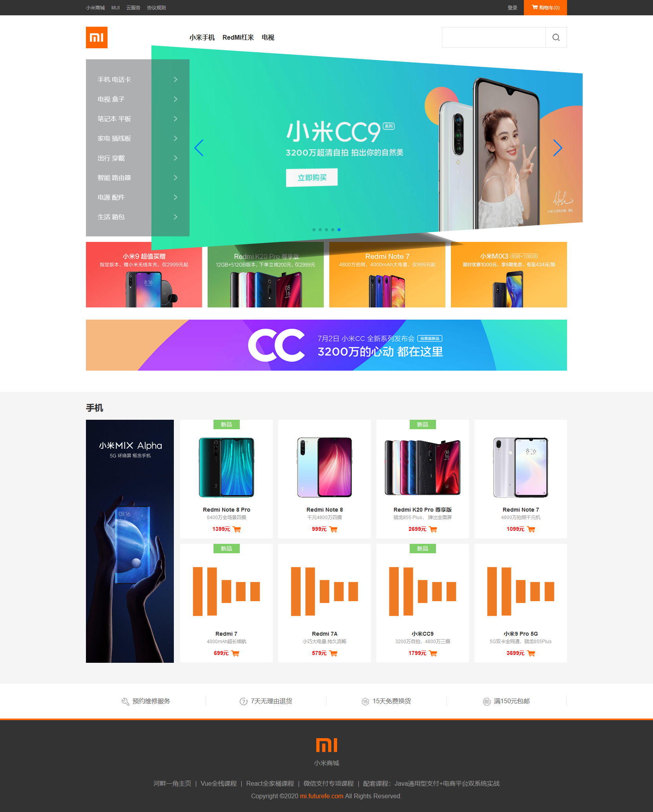

# mimall
使用Vue仿小米官网项目
项目体验链接：http://mi.futurefe.com
## Project setup
```
npm install
```

### Compiles and hot-reloads for development
```
npm run serve
```

### Compiles and minifies for production
```
npm run build
```

### Lints and fixes files
```
npm run lint
```

### Customize configuration
See [Configuration Reference](https://cli.vuejs.org/config/).
### 知识点
```
1.吸顶
2.微信支付
```
## swiper中文文档
https://www.swiper.com.cn/

## Css3动画库
https://daneden.github.io/animate.css/

## 微信扫码支付开发文档
https://pay.weixin.qq.com/wiki/doc/api/index.html

https://pay.weixin.qq.com/wiki/doc/api/native.php?chapter=6_5

## 项目部署说明

## 项目截图
### 首页

### 登录页

### 权限管理-角色列表

### 权限管理-角色列表（分配权限）

### 权限管理-权限列表

### 商品管理-商品列表

### 商品管理-商品列表（添加）

### 商品管理-分类参数


### 商品管理-商品分类

### 订单管理-订单列表

### 订单管理-订单列表(物流信息)

### 订单管理-订单列表(修改订单地址)

### 数据统计-数据报表（添加）


