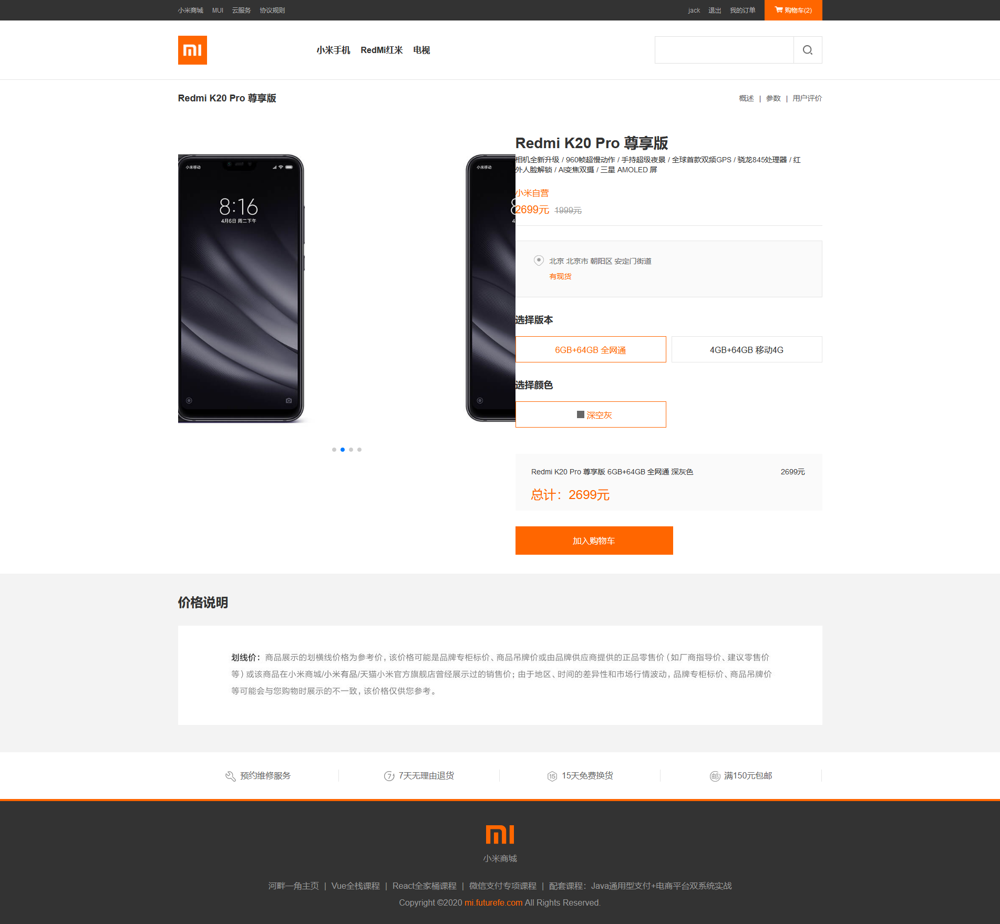
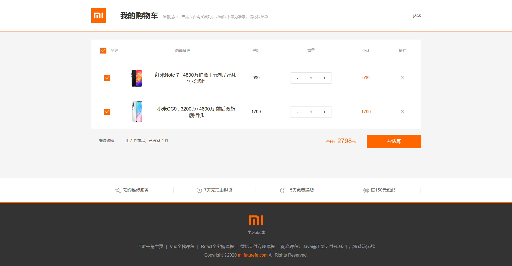
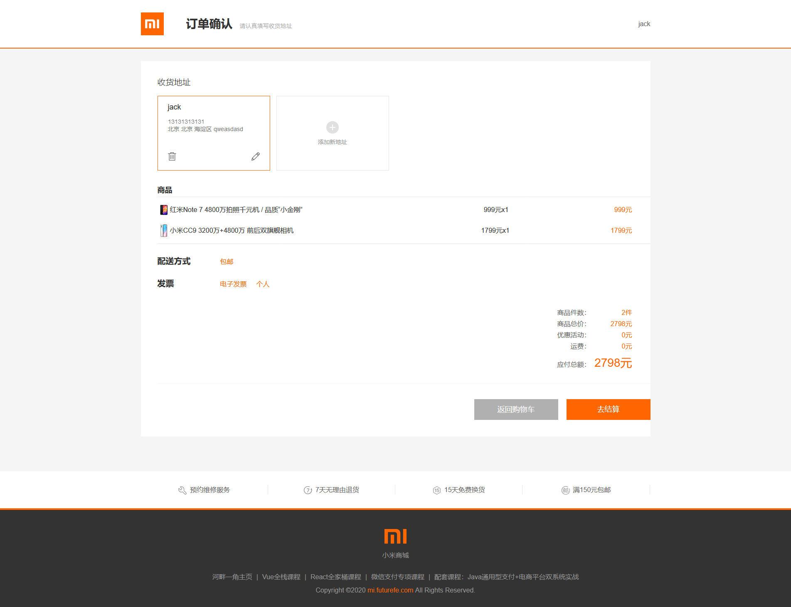
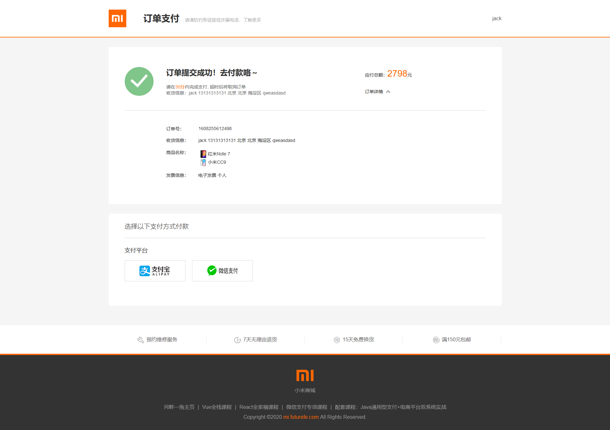
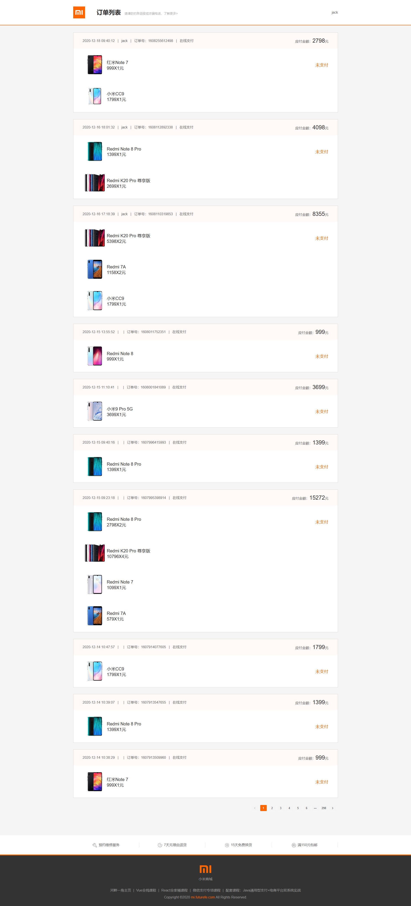

# mimall
使用Vue仿小米官网项目
项目体验链接：http://mi.futurefe.com
## Project setup
```
npm install
```

### Compiles and hot-reloads for development
```
npm run serve
```

### Compiles and minifies for production
```
npm run build
```

### Lints and fixes files
```
npm run lint
```

### Customize configuration
See [Configuration Reference](https://cli.vuejs.org/config/).
### 知识点
```
1.吸顶
2.微信支付
```
## swiper中文文档
https://www.swiper.com.cn/

## Css3动画库
https://daneden.github.io/animate.css/

## 微信扫码支付开发文档
https://pay.weixin.qq.com/wiki/doc/api/index.html

https://pay.weixin.qq.com/wiki/doc/api/native.php?chapter=6_5

## 项目部署说明

## 项目截图
### 首页

### 登录页

### 产品站页面

### 商品详情页面

### 购物车列表页面

### 订单确认页面

### 订单结算页面

### 订单列表页面



